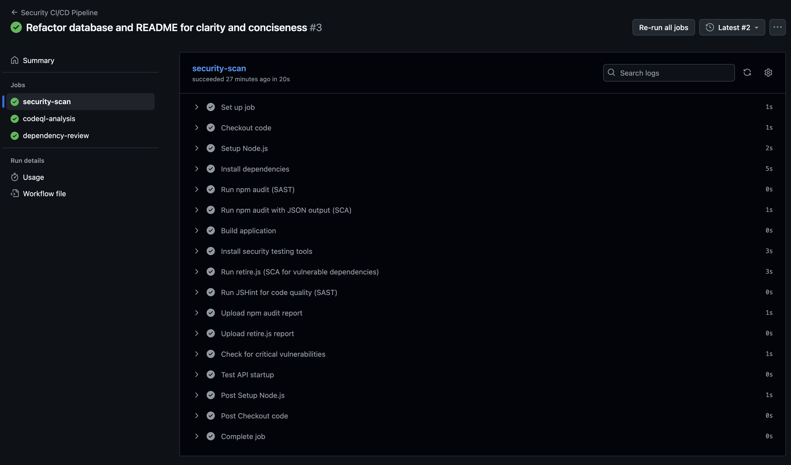
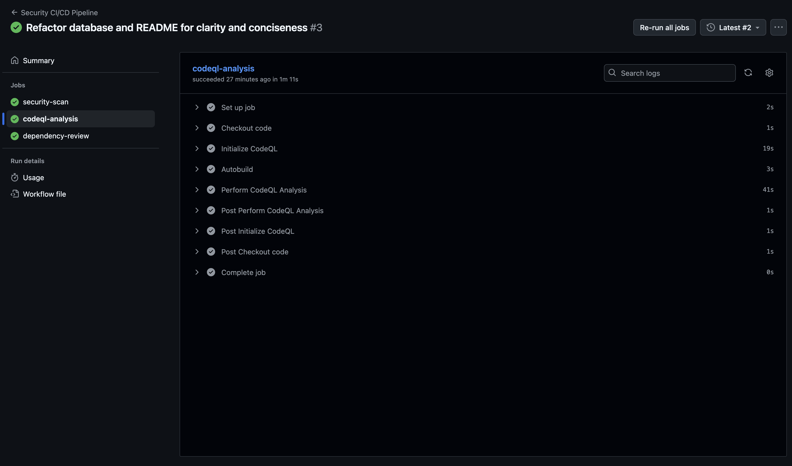

# Lab1

#### Authentication & Authorization

- Выдача JWT-токена при успешном входе
- Защищённые маршруты с аутентификацией через middleware
- Хеширование паролей с помощью bcrypt (12 раундов соли)
- Безопасная проверка учетных данных

#### SQL Injection Protection

- Параметризованные запросы с использованием подготовленных выражений SQLite
- Санитизация и валидация входных данных
- Отсутствие конкатенации строк при формировании SQL-запросов

#### XSS Protection

- Кодирование HTML-сущностей для всего пользовательского контента
- Санитизация данных перед отправкой в ответе
- Заголовки политики безопасности контента (Content Security Policy)

#### Rate Limiting

- Общий лимит запросов к API (100 запросов/15 мин)
- Более строгий лимит для эндпоинтов аутентификации (5 попыток/15 мин)
- Автоматическая блокировка при превышении лимита запросов

#### Security Headers

- Helmet.js для комплексных HTTP-заголовков безопасности
- CORS-защита с настраиваемыми источниками
- Политика безопасности контента (Content Security Policy)
- X-Frame-Options, X-Content-Type-Options и другие заголовки

### API Endpoints

#### Public Endpoints

- `GET /health`
- `POST /auth/login`
- `POST /api/users`

#### Protected Endpoints (Require JWT Token)

- `GET /api/data`
- `POST /api/posts`

### CI/CD Pipelines




### Demo User

- **Username**: `demo_user`
- **Password**: `demo123`

## Testing

### Automated Testing

```bash
bun run test:api
```

### Manual Testing with curl

```bash
curl http://localhost:3000/health

curl -X POST http://localhost:3000/auth/login \
  -H "Content-Type: application/json" \
  -d '{"username":"demo_user","password":"demo123"}'

curl -H "Authorization: Bearer TOKEN" \
  http://localhost:3000/api/data

curl -X POST http://localhost:3000/api/users \
  -H "Content-Type: application/json" \
  -d '{"username":"newuser","email":"new@example.com","password":"securepass123"}'
```

## Security Testing Results

### SAST/SCA Integration

- **Static Application Security Testing (SAST)**:

  - npm audit для поиска уязвимостей в зависимостях
  - JSHint для анализа качества кода
  - GitHub CodeQL для продвинутого статического анализа

- **Software Composition Analysis (SCA)**:

  - OWASP Dependency-Check с помощью retire.js
  - Автоматизированное сканирование на уязвимости
  - Блокировка при обнаружении критических уязвимостей

## CI/CD Pipeline

### Automated Security Scanning

- Запускается при каждом push и pull request
- SAST-анализ с помощью npm audit и CodeQL
- SCA с retire.js для поиска уязвимостей в зависимостях
- Обнаружение и блокировка критических уязвимостей
- Генерация артефактов с отчётами по безопасности

### Pipeline Features

- Среда Node.js 18
- Автоматическая установка зависимостей
- Многоэтапный анализ безопасности
- Генерация отчётов и хранение артефактов
- Проверка сборки
- Тестирование запуска API
